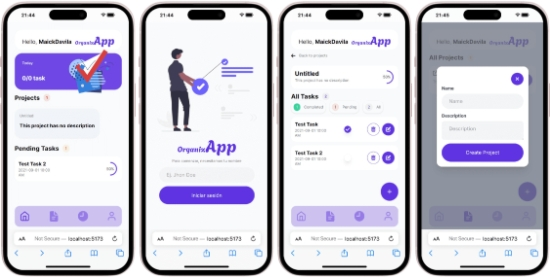

# Proyecto Vue 3 + TypeScript + Vite

Este proyecto utiliza Vue 3, TypeScript y Vite para desarrollar una aplicación web. La aplicación incluye una lista de
proyectos con la capacidad de ver detalles, editar y eliminar proyectos.

## Capturas de pantalla

A continuación, se muestran algunas capturas de pantalla de la aplicación:

### Pantalla de inicio de sesión

## Live Demo

Puedes ver una demostración en vivo de la aplicación en el siguiente
enlace: [URL de la demostración](https://organizapp.maickdavila.dev/)

## Características

- Lista de proyectos: Muestra todos los proyectos disponibles.
- Detalles del proyecto: Permite al usuario ver los detalles de un proyecto específico.
- Edición de proyectos: Permite al usuario editar los detalles de un proyecto existente.
- Eliminación de proyectos: Permite al usuario eliminar un proyecto existente.

## Creación de Tareas

Este proyecto también permite la creación de tareas dentro de cada proyecto. Los usuarios pueden agregar, editar y
eliminar tareas, lo que proporciona una mayor organización y seguimiento del progreso del proyecto.

### Características de las Tareas

- Creación de tareas: Los usuarios pueden crear nuevas tareas para cada proyecto.
- Edición de tareas: Los usuarios pueden editar los detalles de las tareas existentes.
- Eliminación de tareas: Los usuarios pueden eliminar tareas que ya no sean necesarias.

### Marcar Tareas como Completadas

Este proyecto también permite marcar las tareas como completadas. Los usuarios pueden hacer check a las tareas para
indicar que han sido finalizadas. Esta funcionalidad proporciona una manera eficiente de llevar un seguimiento del
progreso de las tareas dentro de cada proyecto.

- Marcar tareas como completadas: Los usuarios pueden hacer check a las tareas para indicar que han sido finalizadas.

## Tecnologías utilizadas

- Vue 3: Un marco de trabajo para construir interfaces de usuario.
- TypeScript: Un lenguaje de programación que se basa en JavaScript, añadiendo tipado estático y objetos basados en
  clases.
- Vite: Un entorno de desarrollo que sirve a su código a través de ES Module Imports durante el desarrollo, lo que
  permite un rápido tiempo de recarga de la página.
- Tailwind CSS: Un marco de trabajo de diseño CSS que proporciona estilos predefinidos y utilidades de diseño.

## Cómo ejecutar el proyecto

1. Clonar el repositorio
2. Instalar las dependencias con `npm install`
3. Ejecutar el proyecto con `npm run dev`